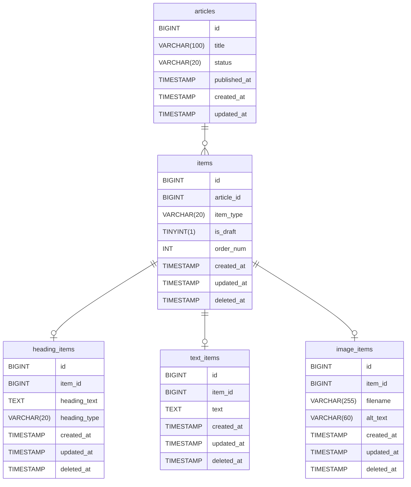

# TRUSTRIDGE コーディングテスト1

## システム概要
メディア記事を管理するためのAPIサーバーがLaravelで実装されています。  
記事は複数の「記事アイテム」から構成されており、記事アイテムには「見出し」「テキスト」「画像」の3種類があります。各テーブルの関係は以下のようになっています。


このAPIサーバーは以下のように起動することができます。
```shell
docker compose run composer install
docker compose run app php artisan migrate
docker compose run app php artisan db:seed
docker compose up -d
```

現在は記事情報を取得するAPI`GET /api/articles/{article_id}/preview`のみが実装されています。
```shell
curl -X GET http://localhost:8000/api/articles/1/preview
```

テストは以下のように実行できます。
```shell
docker compose run app php artisan test
```

## 問題
記事にリンクを載せるため、新しく「リンク」アイテムを作ることにしました。  
DBテーブルを作成し、既存のAPI`GET /api/articles/{article_id}/preview`にリンクアイテムの対応を追加してください。

- DBテーブルについて
  - テーブル名は`link_items`とします。カラム名は任意に設定してください。
  - リンクアイテムが持つ情報は以下の3つで、いずれも作成時必須となります。
    - リンクタイトル（最大100文字）
    - リンクURL
    - リンク種別（「ボタンリンク」「テキストリンク」のどちらかが選べる想定です）
- APIについて
  - `GET /api/articles/{article_id}/preview`で上記リンクアイテムの持つ情報を返すようにしてください
- その他どのようなクラスを作るか、命名などの設計はお任せします。
