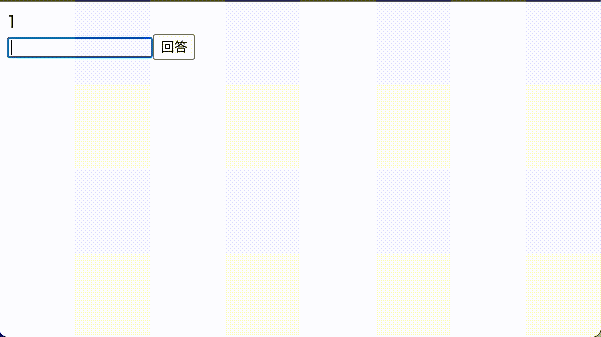

# TRUSTRIDGE コーディングテスト2

## セットアップ
```shell
docker compose run app npm ci
docker compose up -d
```

`http://localhost:5173`をブラウザで開いてください。

## 問題
FizzBuzzを回答するシングルページアプリケーションを実装します。  
Vue.js2で作りかけのアプリケーションがあるので、完成イメージを参考にApp.vueを実装してください。

- 1から順番に表示される数字に対してFizzBuzzの出力を回答します。
- 正解の場合は「せいかい！」の表示とともに、回答欄をリセットして表示される数字をインクリメントします。
- 不正解の場合は「まちがい！」と表示します。正解するまで同じ数字を表示し続けます。
- `fizz` `buzz` `fizzbuzz` は大文字小文字を区別しません。
- 正解/不正解時のメッセージ表示用に[ankurk91/vue-toast-notification](https://github.com/ankurk91/vue-toast-notification/tree/v1.x)パッケージが入っているので利用してください。
```js
this.$toast.success('せいかい！');
this.$toast.error('まちがい！');
```

## 完成イメージ

